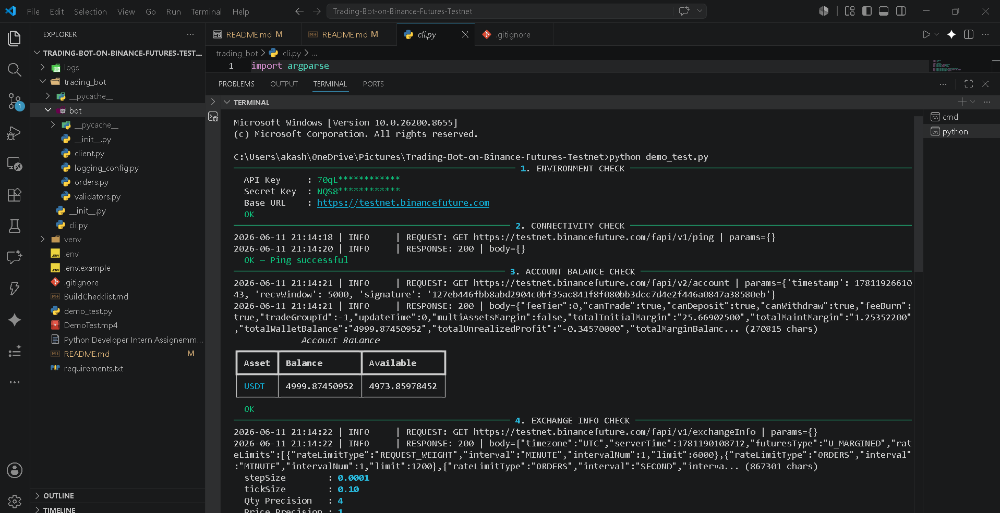

# Trading Bot for Binance Futures Testnet (USDT-M)

## Demo

[](https://github.com/itsakash-real/Trading-Bot-on-Binance-Futures-Testnet/raw/main/DemoTest.mp4)

Click the image above to watch the demo.

This project is a command-line trading bot built in Python for the Binance Futures Testnet (USDT-M). The bot allows users to place both MARKET and LIMIT orders through a simple CLI interface while handling authentication, request signing, input validation, precision management, and logging automatically.


## Prerequisites

- Python 3.10+
- A Binance account (any tier — testnet is free)

## Setup

### 1. Binance Futures Testnet Account

1. Go to [https://testnet.binancefuture.com](https://testnet.binancefuture.com)
2. Log in with your Binance account or register a new one
3. After login, navigate to **API Management** (under your profile menu)
4. Click **Create API Key**, select **System Generated**, label it "Trading Bot"
5. Enable **Enable Futures** permission
6. Copy the **API Key** and **Secret Key** (the secret is shown only once)

### 2. Configure Environment

```bash
# Clone and enter the project
cd Trading-Bot-on-Binance-Futures-Testnet

# Create and activate virtual environment
python3 -m venv venv
source venv/bin/activate

# Install dependencies
pip install -r requirements.txt

# Set up API credentials
cp .env.example .env
# Edit .env and paste your testnet API key and secret:
#   BINANCE_API_KEY=your_testnet_api_key_here
#   BINANCE_SECRET_KEY=your_testnet_secret_key_here
```

## Usage

### Flag Mode (CLI arguments)

Place a MARKET buy order:
```bash
python -m trading_bot.cli --symbol BTCUSDT --side BUY --type MARKET --quantity 0.001
```

Place a LIMIT sell order:
```bash
python -m trading_bot.cli --symbol BTCUSDT --side SELL --type LIMIT --quantity 0.001 --price 100000
```

### Interactive Mode

Run with no arguments for guided prompts:
```bash
python -m trading_bot.cli
```

You will be prompted for symbol, side, order type, quantity, and price (LIMIT only). Invalid inputs show inline errors and re-prompt without crashing.

### Help

```bash
python -m trading_bot.cli --help
```

## Output

- A **Request Summary** panel is displayed before placing the order
- After execution, a **formatted table** shows `orderId`, `status`, `executedQty`, `avgPrice`, and a success/failure banner
- All API requests, responses, and errors are logged to `logs/trading_bot.log`

## Assumptions

- **One-Way position mode** — the bot does not switch between Hedge and One-Way modes. Ensure your testnet account is in One-Way mode.
- **GTC (Good-Til-Cancelled)** is used as the default `timeInForce` for all LIMIT orders.
- **Quantity and price precision** is derived from exchange info filters (`stepSize` / `tickSize`) and applied automatically.
- The user supplies values within valid LOT_SIZE, PRICE_FILTER, and MIN_NOTIONAL constraints.
- The bot targets the **Binance Futures Testnet** only (`https://testnet.binancefuture.com`). No mainnet support.

## Project Structure

```
trading_bot/
├── bot/
│   ├── __init__.py          # Package marker
│   ├── client.py            # Binance Futures API client (auth, signing, HTTP)
│   ├── orders.py            # Order placement (MARKET, LIMIT) + response formatting
│   ├── validators.py        # Input validation + precision helpers
│   └── logging_config.py    # Logging setup (file + console)
├── cli.py                   # CLI entry point (argparse + interactive mode)
├── logs/                    # Log output directory
└── requirements.txt         # Dependencies
```
